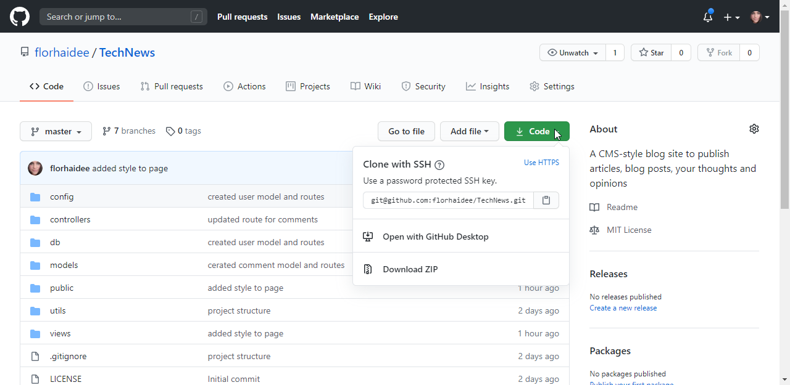
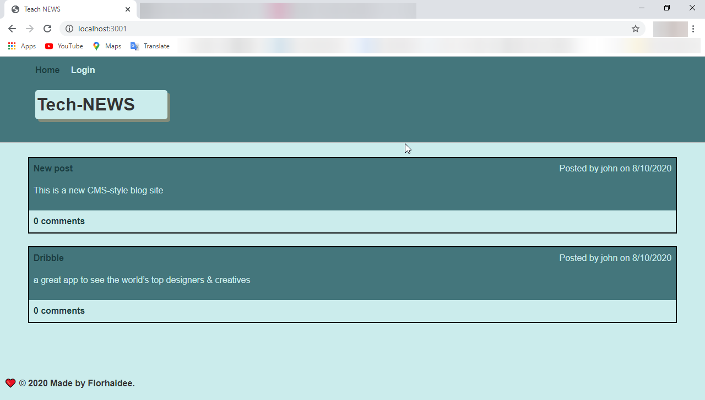
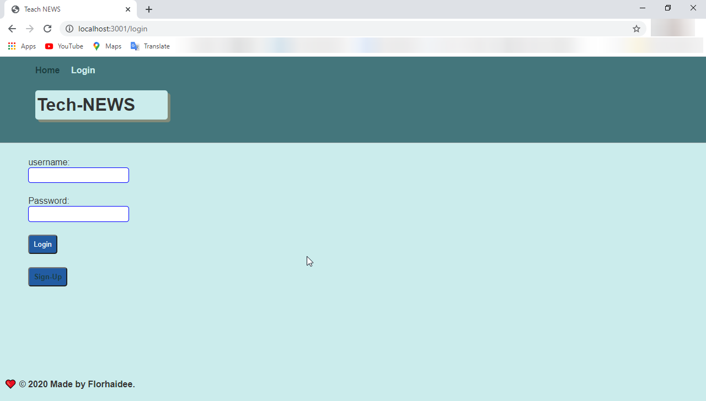
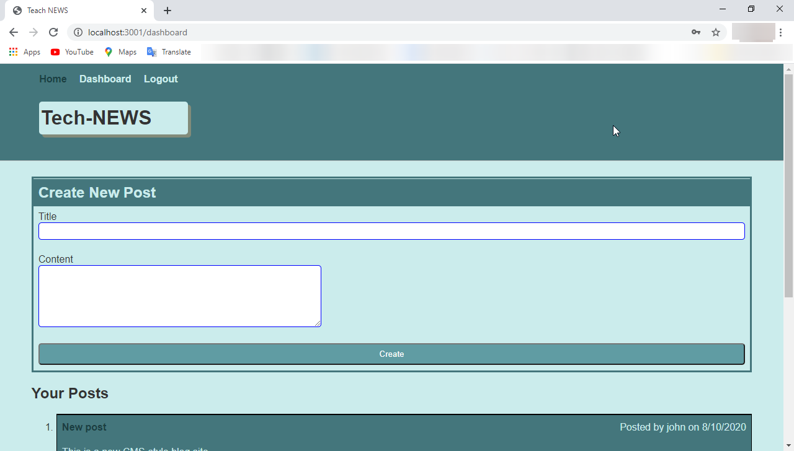
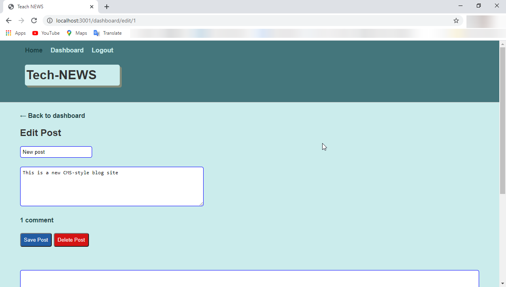
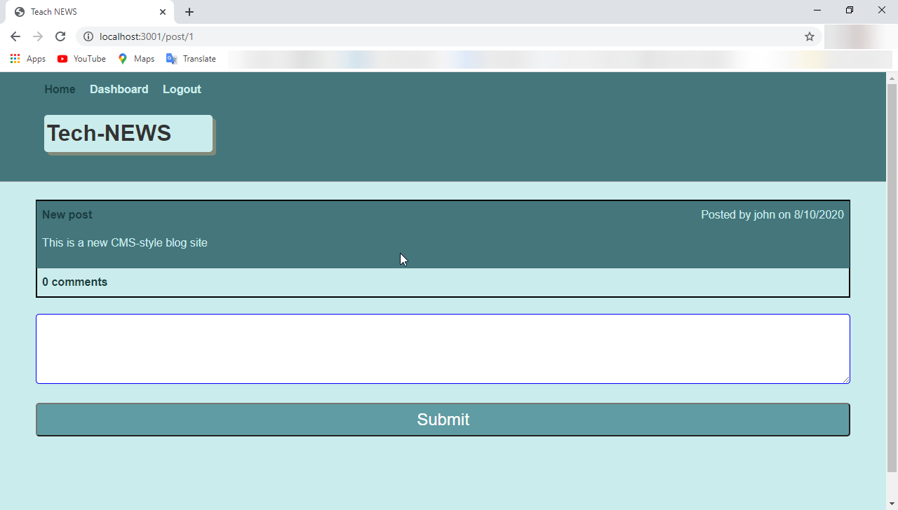

# TechNews  [](code_of_conduct.md)
 A CMS-style blog site to publish articles, blog posts, your thoughts and opinions

  ## Description 

 A Tech blog where users can login and add post and/or comments to it


  ## Table of Contents 
  * [Installation](#installation)
  * [Usage](#usage)
  * [License](#license)
  * [Contributing](#contributing)
  * [Questions](#questions)
  


  ## Installation

    1. Download or clone this repository on your computer.



    2. To install all dependencies:

        * Open your editor and type the following command into your terminal, once you've navigated to the root directory of the project
        ```
        npm init 
        ```
        * Install all the dependencies using npm
        ```
        npm install -y

        ```
        * Configure MYSQL to create the database;
            Yoy can do it by going to folder 'config/' and the file connection.js to configure the conection to the database;

    3. Start the application:
        *Open the terminal on the root directory of the project:
        ```
        npm start

        ```

  ## Usage

  To use the app on your machine type on the browser: "http://localhost:3001/" or just  go to the deployed URL: https://gentle-bayou-27027.herokuapp.com/

    #### Homepage:
    it will display the following site:



    Here you can see all post created 

    #### Login:
    To login, click on the navigation bar, on "Login" option and will display the login or signup page:



    #### Dashboard:

        ##### Create a post

            After signup or login, will get you to your dashboard page:



            There will display all your post and the option to create a new one.

        ##### Edit a post

            You can edit a previous post too:



            On this page you can edit your post or delete it.

    #### Add comment:

        To add a comment just go to the homepage and click on the comments link on the booton of the post:


        And will take you to a new page to add a new comment:




  ## License

    Copyright © 2020 florhaidee. 
    Licensed under the MIT to see more about this license you can find it on the file 'license.txt' go to:

[License](LICENSE) 


  ## Contributing 

    Please note that this project is released with a Contributor Code of Conduct. By participating in this project you agree to abide by its terms.
    Visit:
https://www.contributor-covenant.org/version/2/0/code_of_conduct/ to have more information.

    To contribute 
     * Add an issue
     * Create a new branch with format-name: 
        - (feature/name/your-name) or (bug/name/your-name) 
     * Make a pull request.


  ## Questions

    If you have more questions about this application, you can contact me by:
      email: florhaideeg@gmail.com
      GitHub username: florhaidee


  ## ©️2020  Made with ❤️ by florhaidee
